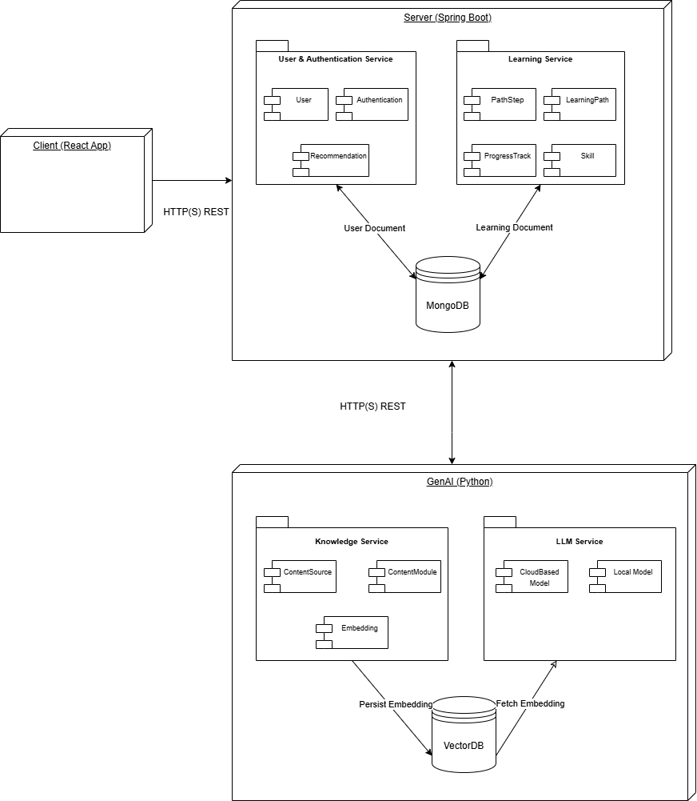
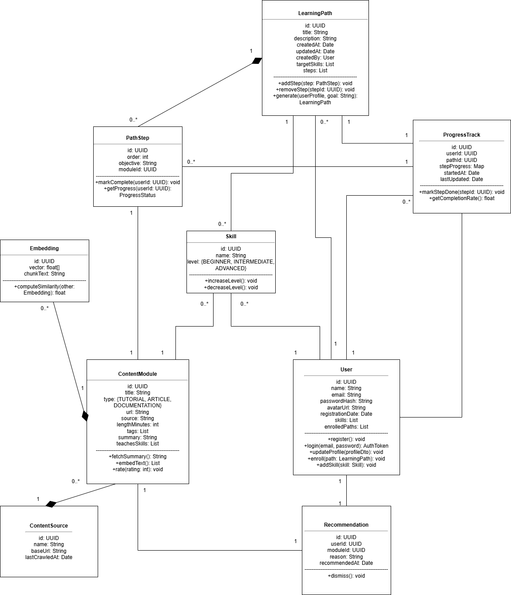
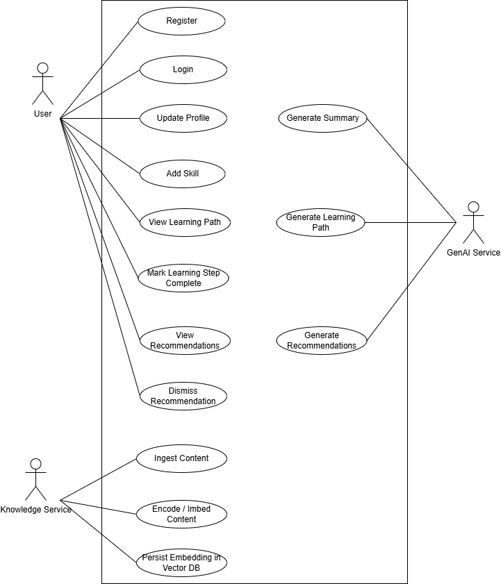

# 📝 System Overview —> Architecture

> ⚠️ **Important**: This document is a draft and might be updated throughout the project.

## 1. Initial System Structure

### System Overview: Top-Level Architecture

The system consists of three main blocks: 

1. **Server: Spring Boot REST API**
    - **Language**: Java
    - **Framework**: Spring Boot
    - **Database**: MongoDB
    - **Description**: 
        - Has a "User Service": 
            - Manges the user data (name, email, skills, current learning progress, etc.)
            - Data is saved and retrieved from the MongoDB database.
        - Has "Learning Service": 
            - Manges the learning data (learning paths, courses, assosiated skills, etc.)
            - Learning paths are created with the help of the GenAI service, saved in the MongoDB database, and can be retrieved by the server.
    - **Communication**: 
        - The server communicates with the GenAI service using REST API calls.
            - Example: 
                - The server sends a request to the GenAI service to generate a personalized learning path based on user input/profile.
                - The GenAI service processes the request and sends back the generated learning path.

**2. Client:**
- **Language**: Typescript
- **Framework**: React
- **Description**: 
    - The client is a web application that allows users to interact with the system.
    - It provides a user-friendly interface for users to manage their learning paths and courses.
    - The client communicates with the server via REST API calls.
- **Communication**: 
    - The client communicates with the server using REST API calls.

**3. GenAI Service:**
*- **Language**: Python
- **Framework**: LangChain
- **Database**: Weaviate (a vector database)
- **Description**: 
    - Has a "Knowledge Service" that acts as the main knowledge base for the system.
        - Responsible for collecting and storing data from various sources (through web scraping, newsletters, etc.) into the Weaviate database.
    - Has an "LLM Service"
        - Responsible for generating personalized learning paths and courses based on user input/profile and the knowledge stored in the Weaviate database.
- **Communication**: 
    - The GenAI service communicates with the server using REST API calls.
        - Example: 
            - The GenAI service generated a random learning path based on new scrapped data. It sends the learning path to the server, which saves it in the MongoDB database (non-personalized learning paths).
    - Inside the GenAI service, the LLM service retrive embeddings, which were generated by the Knowledge service, from the Weaviate database.
    

A Diagram of the Top-Level system architecture is shown below:

### Analysis Object Model

The following analysis object model is a simplified draft representation of the system's main components and their relationships. It includes the following classes:

- **LearningPath**: Represents a learning path.
- **PathStep**: Represents one ordered unit within a LearningPath, pointing to a specific module.
- **User**: Represents a user.
- **ProgressTrack**: Represents a user’s completion state for every step in a given path.
- **Skill**: Represents a skill.
- **ContentModule**: Represents a content module.
- **ContentSource**: Represents a content source from which the data is scraped forexample.

> An additional explanation of the classes and their relationships can be found in the following attached document: [Explanation of the Analysis Object Model](./architecture/analysis_object_model_explanation.md)

### Use Cases

The following use case diagram represents the main interactions between users and the system. It includes the following actors:
- **User**: Represents a user of the system.
- **Knowledge Service**: Represents the Data collector, kind of the crawler.
- **LLM Service**: Represents the GenAI service that generates personalized learning paths, courses and recommendations.

## 2. First Product Backlog

The product Backlog are being organised as GitHub issues. Please refer to the [GitHub issues page](https://github.com/AET-DevOps25/team-git-it-together/issues)