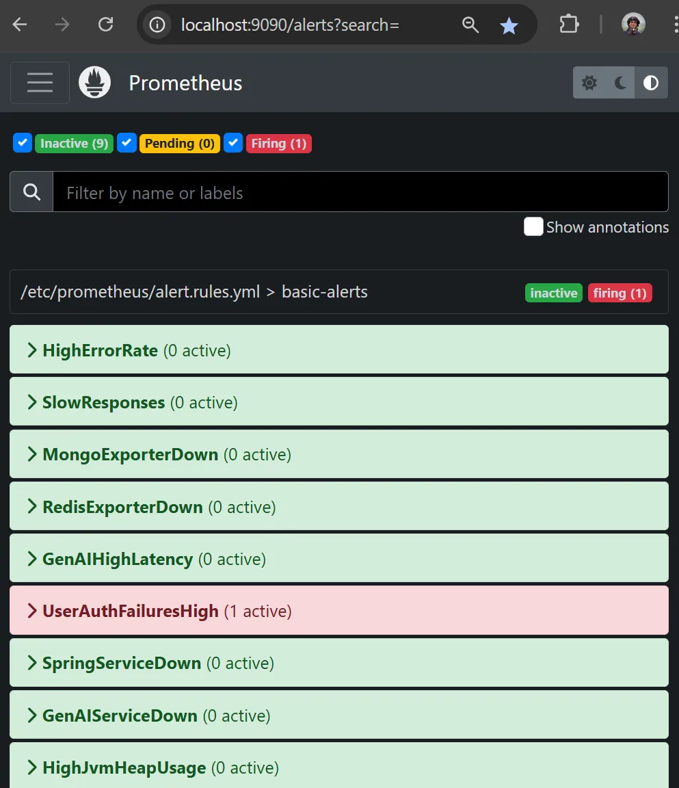

# Observability & Alerting Quick Reference

This repo includes a minimal **Prometheus + Alertmanager + Grafana** stack with **MailHog** for local alert testing — no external services needed.

| Component   | Container     | Host Port(s)        | Purpose                                               |
|-------------|--------------|---------------------|-------------------------------------------------------|
| Prometheus  | `prometheus` | **9090**            | Scrapes metrics and evaluates rules (`alert.rules.yml`). |
| Alertmanager| `alertmanager`| **9093**           | Routes fired alerts via MailHog (`alertmanager.yml`). |
| Grafana     | `grafana`    | **3001**            | Dashboards + unified alert panel.                     |
| MailHog     | `mailhog`    | **8025 (UI)`/`1025 SMTP | Captures alert e-mails for inspection.            |

---

## Viewing Alerts Live

1. **Prometheus** – raw alert state  
   [http://localhost:9090/alerts](http://localhost:9090/alerts)
2. **Grafana** – visual alert panel  
   [http://localhost:3001/dashboards](http://localhost:3001/dashboards) → open *Logs* or any dashboard with **Active Alerts**
3. **MailHog** – captured alert e-mails  
   [http://localhost:8025/](http://localhost:8025/)

> Alertmanager sends all alerts to `oncall@skillforge.ai` via the local SMTP relay at `mailhog:1025` (no TLS).  
> **No external mail is sent.**

---

## Example Alert Screenshots

---

## Notes

- Prometheus scrape/rule interval ≈ **15s** — expect up to ~30s delay before alerts *fire*.
- Dashboards use the pre-provisioned `DS_PROMETHEUS`. The *Logs* dashboard also uses **Loki**.
- MailHog is ephemeral — inbox resets on container restart.