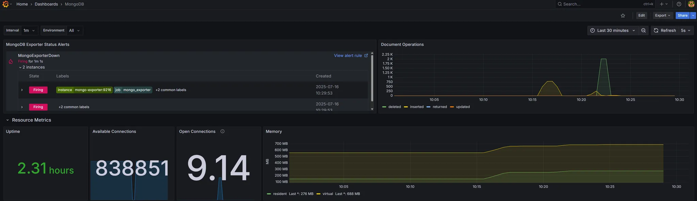

# Grafana Dashboards

This directory contains all pre-provisioned Grafana dashboards for SkillForge observability. Dashboards are auto-loaded when Grafana starts—no manual import needed.

## Usage

- Access Grafana at [http://localhost:3001/](http://localhost:3001/)
- Default login: `admin` / `admin` (or use `GF_SECURITY_ADMIN_PASSWORD`)
- Browse dashboards under **Dashboards → Browse**

## Dashboard Overview

| File                     | Focus                    | Data Sources         |
|--------------------------|-------------------------|---------------------|
| `genai.json`             | GenAI FastAPI metrics   | Prometheus          |
| `mongo.json`             | MongoDB internals       | Prometheus          |
| `server.json`            | Spring Boot JVM + HTTP  | Prometheus          |
| `user-custom-metrics.json`| Auth failures, signups | Prometheus          |
| `logs.json`              | Central logs + alerts   | Loki + Prometheus   |

Each dashboard includes a testing section with curl/docker commands to help you simulate traffic or errors.

---

For more on alerting and monitoring setup, see the main [README](../README.md) and [ALERTS.md](../ALERTS.md).


> This directory documents all pre-provisioned Grafana dashboards used to monitor SkillForge services.
> 
> 
> Dashboards pull metrics from **Prometheus** and logs from **Loki**, with real-time alert visibility across the system.
> 

Each section covers:

- Dashboard purpose
- Key metrics/panels
- Testing instructions to simulate traffic, errors, or alerts

---


## Index

- [GenAI Observability Dashboard](#genai-observability-dashboard)
- [MongoDB Observability Dashboard](#mongodb-observability-dashboard)
- [SkillForge Server Observability Dashboard](#skillforge-server-observability-dashboard)
- [User Service – Custom Metrics Dashboard](#user-service--custom-metrics-dashboard)
- [SkillForge Logs: Centralized Logging & Alerts](#skillforge-logs-centralized-logging--alerts)


# GenAI Observability Dashboard


## Overview

- Monitors FastAPI-based GenAI service.
- Data source: **Prometheus** (`DS_PROMETHEUS`).
- Refresh: Every 5s | Time range: Last 5 mins.
- Metrics scoped via `app_name=genai`, `job="genai"`.

## Key Panels & Metrics

- **Service Version:** From `GENAI_APP_VERSION` (.env).
- **Total Exceptions:** All FastAPI-raised exceptions.
- **Total Requests:** Overall request count.
- **Requests Count:** Breakdown by method/path.
- **Average Request Latency:** Measures per-endpoint latency.
- **Request Rate:** Throughput (req/s).
- **Uptime / Restarts:** Container health.
- **Memory / CPU:** Resource usage.
- **Status Alerts:** Shows active GenAI alerts.

## Testing & Simulating Metrics

- 🔁 **Send test requests:**
    - `GET {{baseURL_genai}}/api/v1/debug/error` → simulates 500 error (exceptions panel)
    - `GET {{baseURL_genai}}/api/v1/health` → normal traffic (requests panels)
- 🔧 **Restart container:**
    - `docker compose restart skillforge-genai` → resets uptime, increments restarts
- ❌ **Trigger alert (GenAIServiceDown):**
    - `docker compose stop skillforge-genai`
        - Alert shows as *pending* after ~1 min → then *firing*
        
        
        
        
        
- ✅ **Recover after testing:**
    - `docker compose up --build -d skillforge-genai`

# MongoDB Observability Dashboard



## Overview

- Monitors MongoDB server health and activity.
- Data source: **Prometheus** (`DS_PROMETHEUS`).
- Refresh: Every 5s | Time range: Last 30 mins.
- Metrics scoped via `job="mongo"` | Use `Environment` dropdown for multi-env.

## Key Panels & Metrics

- **Exporter Status Alerts:** Shows active alerts , namely exporter down.
- **Document Ops/sec:** Insert, update, delete, return rates.
- **Connections:** Available vs. Open client connections.
- **Memory Usage:** Resident (RAM) and virtual memory in MB.
- **Uptime:** MongoDB process runtime in seconds.

## Testing & Simulating Metrics

- 📥 **Insert/Delete documents:**
    - `python monitoring/scripts/test_mongo_memory.py`
    - Inserts + deletes 1,000 docs to simulate load.
- 📊 **Run queries:** Use `find()` / `aggregate()` to simulate read traffic.
    - example: `GET {{baseURL_Gateway}}/{{apiVersion}}/courses/public`
- 🔁 **Restart MongoDB:**
    - `docker compose restart mongo`
    - Resets uptime, affects open connections.
- ❌ **Trigger alert (MongoExporterDown):**
    - `docker compose stop mongo-exporter`

# Skillforge Server Observability Dashboard


## Overview

- Monitors JVM apps via Micrometer (`/actuator/prometheus`).
- Data source: **Prometheus** (`DS_PROMETHEUS`, job: `spring-boot`).
- Refresh: Every 30s | Time range: Last 24h.
- Scoped via `application` and `instance` variables.

## Data Source & Services

- Prometheus job: `spring-boot`.
- Services exposing metrics:
    - `skillforge-gateway` (8081)
    - `skillforge-user-service` (8082)
    - `skillforge-course-service` (8083)

## Key Panels & Metrics

- **Service Versions:** From `APP_VERSION` env.
- **Uptime / Start Time:** Tracks service runtime.
- **Heap / Non-Heap Memory:** JVM usage in %.
- **Request Rate:** Ops/sec.
- **HTTP Errors (5xx):** Error occurrences
- **Request Latency:** Avg & max for 2xx–4xx responses.
- **Restart Detection:** Based on `process_uptime_seconds` reset.

## Testing & Simulating Metrics

- 🆕 **Change version:**
    - change `APP_VERSION` in the .env file ( e.g. `APP_VERSION=1.2.3` )
    - `docker compose up -d --build <service>`
- 🔁 **Send HTTP traffic:**
    - Call `/health`, `/api/...` to generate load.
- ❌ **Simulate 5xx errors:**
    - `GET {{baseURL_Gateway}}/{{apiVersion}}/debug/error`
- 🔄 Uptime reset**:**
    
    ```bash
    docker compose restart <service>
    ```
    

# User Service - Custom Metrics Dashboard


## Overview

- Monitors user activity (signups, auth failures) and deployments.
- Data source: **Prometheus** (`DS_PROMETHEUS`).
- Refresh: Every 10s | Time range: Last 6h.

## Key Panels & Metrics

- **User Signups (Rate):** Signups per second over the last hour
- **User Signups (Count):** Total signups in the last 5 minutes
- **Authentication Failures:** Failed logins per second over 5 minutes
- **Failure Alerts:** Shows currently active high failure rate alerts

## Testing & Simulating Metrics

- 🟢 **Test signups:**
    - Call signup endpoint (e.g., `POST /api/v1/auth/signup`).
- ❌ **Simulate auth failures and trigger the alert:**
    - Attempt logins with invalid credentials. `POST baseURL_Gateway}}/{{apiVersion}}/users/login`
    - Run `monitoring/scripts/test_user_auth_failures.py` to trigger the `UserAuthFailuresHigh` alert.

# SkillForge Logs: Centralized Logging & Alerts


## Overview

- Monitors logs across all services using **Loki** + **Promtail**.
- Alerts sourced from **Prometheus** and shown in unified alert panel.
- Data source: `Loki`, `DS_PROMETHEUS`
- Refresh: Every 10s | Time range: Last 1h.

## Key Panels & Metrics

- **Active Alerts:** Shows firing/pending alerts across all systems.
- **Log Volume by Service:** Total logs per service (5m intervals).
- **Recent Errors:** Total error logs (last hour).
- **Error Volume by Service:** Error logs grouped by service (5m).
- **Log Explorer:** Search and filter logs by service, level, and message.

## Usage

- 🔍 **Search logs:** Use filters (`service`, `level`, `search`) to explore logs.
    
    
    
- 🚨 **Track incidents:** Use alerts panel to monitor system-wide issues in real time.